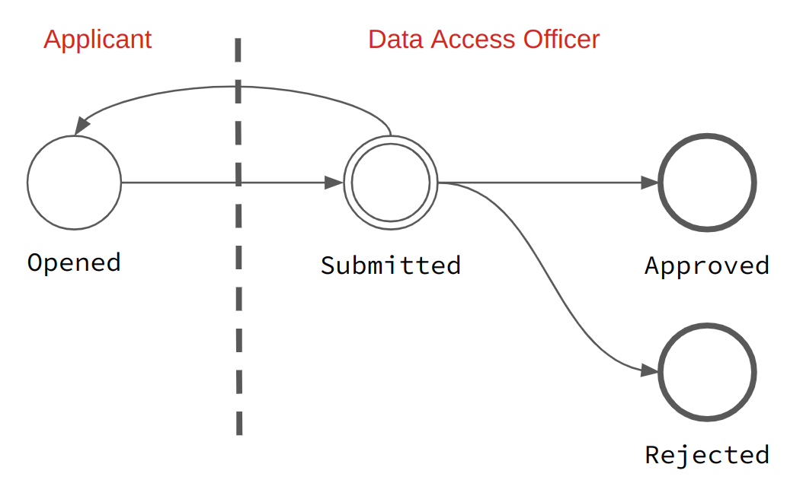
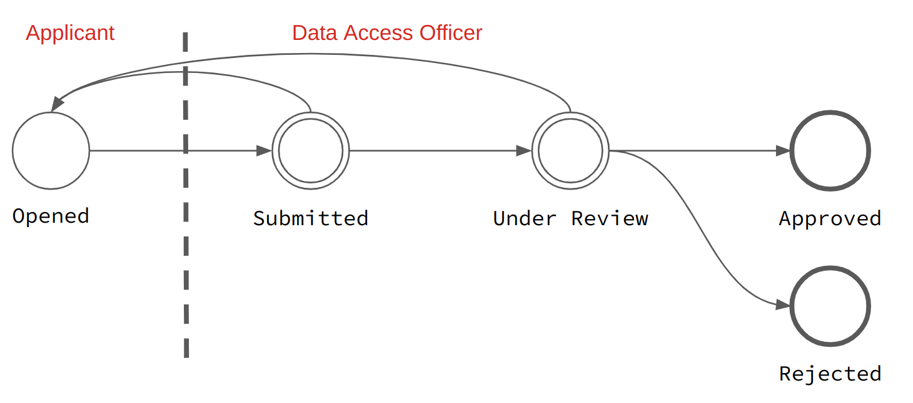
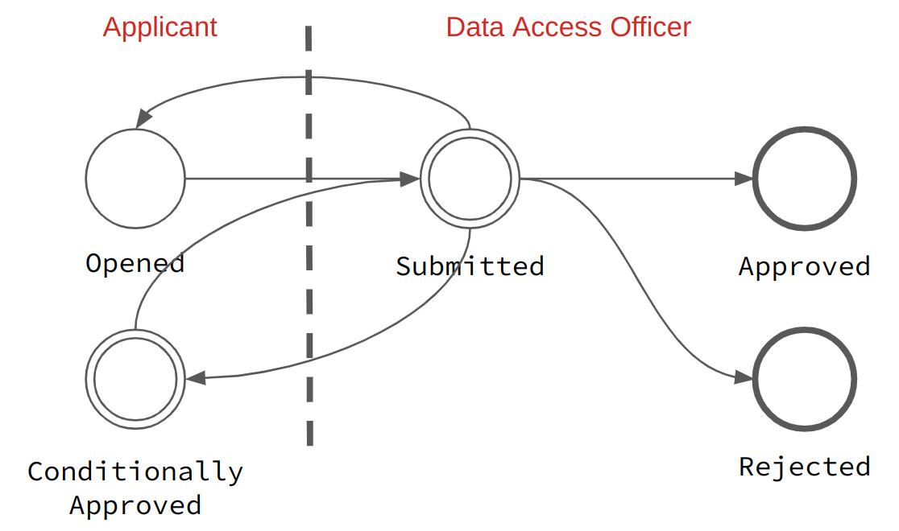
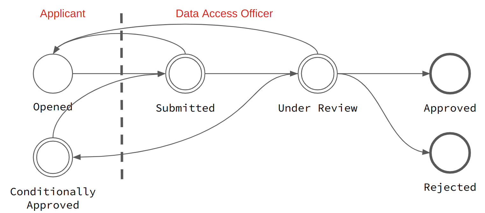

.. _dar:

Data Access Requests Management
===============================

Summary
~~~~~~~

Before requesting access to data, a researcher needs to register and follow some steps to submit a
*data access request*. This access request is composed of at least one main application form to be filled in
by the applicant. Other forms can be enabled for more complex procedures, such as preliminary form, feasibility form,
amendment form and end-user agreement form. Each of these forms is to be designed by the administrator.

Once a form is filled-in and submitted by the applicant, data access officers will review it before approval or rejection.

Notification emails help with the communication between the applicant and the data access officer during the life cycle of each form.

Collaborators can be associated by the applicant to a request. Collaborators can only contribute to their own end-user agreement form (if enabled).

Request Workflow
~~~~~~~~~~~~~~~~

To create a data access request, users have to fill out the application form
and *submit* it once it is completed. The *validate* button can be used to
check that the form contains the required information. Before submitting
he request, the form can be edited and saved (for future edits) as needed.
After the request is submitted, the form is locked and can no longer be
edited unless the request is reopened.

After the request is submitted, a data access officer will *review* it in order
to *approve* or *reject* it. The data access officer can also *reopen* (or
*conditionally approve*) the request if he considers that modifications are
needed. This workflow, as well as email notifications that can be sent on
request status changes, can be configured by the administrator, e.g. to omit
the *review* step or make the *approve*/*reject* steps final.

The most simple workflow is:

* no ``Under Review`` intermediate state
* no ``Conditionally Approved`` intermediate state
* ``Approved`` state is final
* ``Rejected`` state is final

When the ``Under Review`` intermediate state is activated (which is the default
configuration), the flow is:

When the ``Conditionally Approved`` intermediate state is activated, the flow
is:

When both ``Under Review`` + ``Conditionally Approved`` intermediate states are
activated, the flow is:

The workflow is described in the following table:

.. list-table::
  :widths: 15 55 15 15
  :header-rows: 1

  * - Status
    - Description
    - From Status
    - To Status
  * - Opened
    - The request is in an editable state.
    -
    - Submitted
  * - Submitted
    - | The request is submitted to the application officer and is not editable by the applicant.
      |
      | The application officer can (conditionally) approve or reject it or, if configured, go to an intermediate under review status.
    - Opened
    - | Under Review
      | or

      * Approved
      * Rejected
  * - Under Review
    - | The request is being reviewed by the application officer, who can reopen, conditionally approve (if this state is activated), approve or reject the request.
    - Submitted
    - * Opened
      * Approved
      * Rejected
      * Conditionally Approved
      * Submitted
  * - Approved
    - | The request has been approved. If configured, the request can go back to the submitted or reviewed status.
    - | Submitted
      | or
      | Under Review
    - | if state is not final:
      |
      | Submitted
      | or
      | Under Review
  * - Rejected
    - | The request has been rejected. If configured, the request can go back to the submitted or reviewed status.
    - | Submitted
      | or
      | Under Review
    - | if state is not final:
      |
      | Submitted
      | or
      | Under Review
  * - Conditionally Approved
    - | The request was submitted, has been reviewed and some adjustments are required before a final approval.
      |
      | The applicant can edit its request and will re-submit it.
    - | Submitted
      | or
      | Under Review
    - Submitted

Forms
~~~~~

Application Forms
-----------------

Preliminary Form (optional)
^^^^^^^^^^^^^^^^^^^^^^^^^^^

This form is optional and needs to be designed and enabled by the system administrator.

As setting up a research project can take time in terms of definition of the data/biosamples material needed, organizing the human resources, securing a source of funding etc. the preliminary form allows to start the data access request, before finalizing it with a main form.

Main Form
^^^^^^^^^

The application form is to be designed by the system administrator, who can also define the PDF template used to create a printable copy of the form (available by clicking on the *Download* button).

The applicant is responsible for filling-in and submitting this form. The form can be reopened when there are requests for changes. A data access request is approved (resp. rejected) when this form is approved (resp. rejected).

Feasibility Inquiry Form (optional)
-----------------------------------

This form is optional and needs to be designed and enabled by the system administrator.

Researchers can fill in a short form to ensure the feasibility of a project. This can be a preliminary of the main application form or of an amendment. Several feasibility forms can be submitted.

Amendment Form (optional)
-------------------------

This form is optional and needs to be designed and enabled by the system administrator.

Researchers can submit amendments to request changes (e.g. additional data, new research collaborators) to a pre-approved main form. Several amendment forms can be submitted.

End-User Agreement Form (optional)
----------------------------------

This form is optional and needs to be designed and enabled by the system administrator.

In a data access request, the possible strategies to make the end-user agreements available are:

* Always, i.e. as soon as the data access request is created,
* After the Preliminary form is approved,
* After the main form is approved.

When some collaborators are associated to a data access request, each of them must fill-in its own end-user agreement form (the applicant has its own as well).

Documents
~~~~~~~~~

Files can be uploaded by the applicant or the data access officers at any time in the process of the request.

Comments
~~~~~~~~

To enhance the collaboration between users and data access officer, each member can add a comment to a data access request. Mica can be configured to send email notifications when a comment is added or updated.

Private Comments
~~~~~~~~~~~~~~~~

Administrators, data access officers and users with proper permissions (see :ref:`data access request permissions <dar-permissions>`) can add private comments while processing a data access request or an amendment.

.. _dar-history:

History
~~~~~~~

A list of all status changes of a data access request and its amendments. In addition, administrators and data access officers can log actions that they have taken while processing a request or an amendment. These actions are either :ref:`pre-defined <dar-predefined-action-logs>` or free text. Only users or groups with proper permissions (see :ref:`data access request permissions <dar-permissions>`) can view action logs.

Collaborators
~~~~~~~~~~~~~

Other users can be invited to collaborate to a data access request. The applicant sends the invitation by providing the collaborator's email address. This collaborator receives a notification email containing a personal link to accept this invitation. This personal link expires after a configurable number of days (7 by default) and is revocable by the applicant. The collaborator must create an account (with the same email) before accepting the invitation.

A collaborator gets read-only access to the request. When the end-user agreement feature is enabled, each collaborator must fill-in and submit its personal end-user agreement statement.

Notification Emails
~~~~~~~~~~~~~~~~~~~

For each event in the data access request life-cycle, a notification event can be sent:

.. list-table::
  :widths: 20 80
  :header-rows: 1

  * - Event
    - Description
  * - On creation
    - Email is sent to data access officers on data access request creation (i.e. saved for the first time but not yet submitted).
  * - On submission
    - Email is sent to data access officers and to applicant on data access request submission.
  * - On review
    - Email is sent to applicant when its data access request is being reviewed.
  * - On reopening
    - Email is sent to applicant when its data access request is reopened.
  * - On conditional approval
    - Email is sent to applicant when its data access request is in the 'Conditionally Approved' state.
  * - On rejection
    - Email is sent to applicant when its data access request is rejected.
  * - On approval
    - Email is sent to applicant when its data access request is approved.
  * - On comment
    - Email is sent to applicant and data access officers when the data access request is commented.
  * - On documents update
    - Email is sent to applicant and data access officers when the document list of the data access request is updated.

There are also notification emails related to the project reporting:

.. list-table::
  :widths: 20 80
  :header-rows: 1

  * - Event
    - Description
  * - Final report reminder
    - Email is sent to applicant to remind that a final report is due. Applies to approved data access requests only.
  * - Intermediate report reminder
    - Email is sent to applicant to remind that an intermediate (yearly) report is due. Applies to approved data access requests only.

Some emails are sent in relation with collaborators:

.. list-table::
  :widths: 20 80
  :header-rows: 1

  * - Event
    - Description
  * - On collaboration invitation
    - Email is sent to the invited collaborator with a personal link to the data access request.
  * - On collaboration accepted
    - Email is sent to applicant when an invitation to collaborate to the data access request has been accepted.
